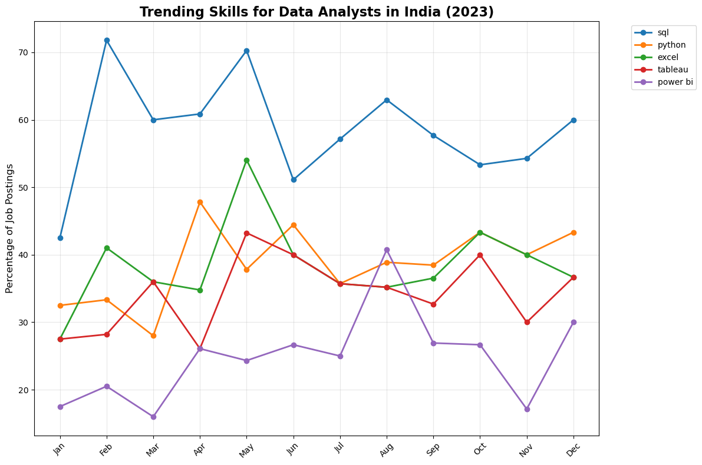
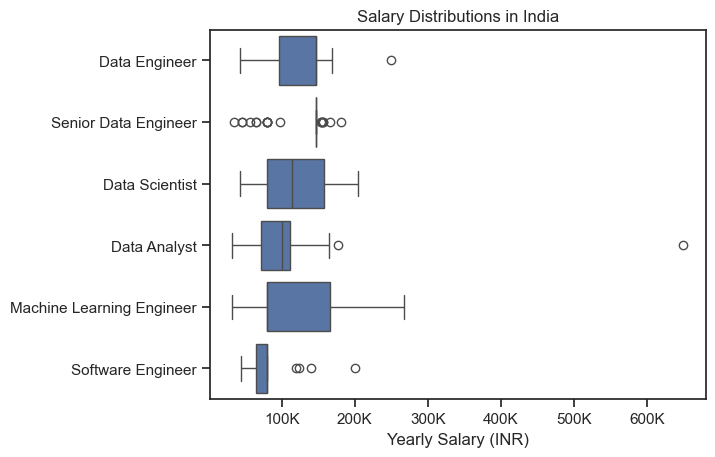

# The Analysis

## What are the most demanded skills for the top 3 most popular data roles?

To find the most demanded skills for the top 3 most popular data roles. I filtered out those positions by which ones were the most popular, and got the top 5 skills for these top 3 roles. This query highlights the most popular job titles and their top skills, showing which skills i should pay attention to depending on the role i'm targeting

View my notebook with detailed steps here[2_skill_demand.ipynb](2_project/2_skill_demand.ipynb)

### Visualize Data

```python
fig, ax =plt.subplots(len(job_titles), 1)

sns.set_theme(style='ticks')

for i, job_title in enumerate(job_titles):
  df_plot = df_skills_perc[df_skills_perc['job_title_short'] == job_title].head(5)
  sns.barplot(data=df_plot, x='skill_percent', y='job_skills', ax=ax[i], palette='dark:b_r', hue='skill_count')
  ax[i].set_title(job_title)
  ax[i].set_ylabel('')
  ax[i].set_xlabel('')
  ax[i].legend().set_visible(False)
  ax[i].set_xlim(0, 78)

  for n, v in enumerate(df_plot['skill_percent']):
    ax[i].text(v+1, n, f'{int(v)}%', va='center')

  if i != len(job_titles) -1:
    ax[i].set_xticks([])


fig.suptitle('Likelihood of Skills Requested in India Job Postings', fontsize=16)
fig.tight_layout(h_pad=0.5)
plt.show()
```

### Results

Visualization of top skills for data roles(2_project/images/top_skills.png)

### Insights
- Python is a versatile skill, highly demanded skill across all three roles, but most prominently for Data Scientist (62%)
- SQL is the most requested skill for Data Analysts and Data Scientists, with it in over half the job postings for noth roles.
- Data Engineers require more sprecialized technical skills (AWS, Azure, Spark) compared to Data Analysts and Data Scientists who are expected to be proficient in more general data management and analysis toils (Excel, Tableau)


## Analysis

### How are in-demand skills trending for Data Analysts in India?
For this analysis I began by filtering the dataset to focus specifically on data analyst roles in the United States. To analyze trends over time I created a new column to represent the month of each job posting. Next, I used exploding techniques to break down individual skills listed within each posting, ensuring that every skill could be analyzed independently.

I then built a pivot table, organized by monthly skill counts, which also included total counts to rank the most frequent skills. Using these totals I calculated percentage-based values for further analysis. Finally, I visualized the top five most in-demand skills by plotting their percentage occurrence across each month in 2023, revealing key trends in skill demand over time.

``` Python

# Step 1: Convert the index (month numbers) into a column
df_DA_percent = df_DA_percent.reset_index()

# Step 2: Convert month numbers to abbreviated names
# Ensure the 'job_posted_month' column is treated as integers for conversion
df_DA_percent['job_posted_month'] = df_DA_percent['job_posted_month'].apply(
    lambda x: pd.to_datetime(f'2023-{int(x)}-01').strftime('%b')
)

# Step 3: Set the cleaned month names as the new index
df_DA_percent = df_DA_percent.set_index('job_posted_month')

# Optional Step 4: Sort the months properly
month_order = ['Jan', 'Feb', 'Mar', 'Apr', 'May', 'Jun',
               'Jul', 'Aug', 'Sep', 'Oct', 'Nov', 'Dec']
df_DA_percent = df_DA_percent.loc[month_order]

df_DA_percent

```


``` Python
# Visualization of top skills trends

# Select top 5 most in-demand skills for cleaner visualization
top_skills = df_DA_percent.mean().sort_values(ascending=False).head(5).index

# Create the plot
plt.figure(figsize=(12, 8))

# Plot trends for top skills
for skill in top_skills:
    plt.plot(df_DA_percent.index, df_DA_percent[skill], marker='o', linewidth=2, label=skill)

plt.title('Trending Skills for Data Analysts in India (2023)', fontsize=16, fontweight='bold')
plt.xlabel('')
plt.ylabel('Percentage of Job Postings', fontsize=12)
plt.legend(bbox_to_anchor=(1.05, 1), loc='upper left')
plt.grid(True, alpha=0.3)
plt.xticks(rotation=45)
plt.tight_layout()
plt.show()
```

### Results



### Insights

- SQL remains the #1 skill throughout the year, consistently demanded in 50-72% of job postings.
- Shows remarkable resilience with peaks in February (~72%) and May (~70%).
- February and May emerge as peak hiring months across multiple skills.
- November shows a significant dip for most skills (SQL, Python, Tableau) - possibly due to year-end budget constraints or holiday seasons.
- Strong recovery in December suggests companies preparing for the new year.


## 3. How well do jobs and skills pay for Data Analysts?

### Salary Analysis for Data Roles


``` Python
sns.boxplot(data=df_india_top6, x='salary_year_avg', y='job_title_short', order=job_order)
sns.set_theme(style='ticks')

plt.title('Salary Distributions in India')
plt.xlabel('Yearly Salary (INR)')
plt.ylabel('')
ticks_x = plt.FuncFormatter(lambda y, pos: f'{int(y/1000)}K')
plt.gca().xaxis.set_major_formatter(ticks_x)
plt.show()
```

### Results


### Insights

- These roles generally command the highest median salaries, around 150,000 INR annually.

- Their salaries are strong, similar to engineers, with a good range of earnings.

- These roles typically have lower starting salaries and less variation, with a median around 75,000-100,000 INR.

-  While varied, Senior Data Engineers can earn considerably more, with some reaching up to 250,000 INR.

- Exceptional performance or niche skills can lead to significantly higher salaries, as seen with a Data Analyst earning over 600,000 INR.


### Analysis

### Plot 1: Highest Paid Skills for Data Analysts in India

## Analysis: 
- This plot highlights specific technologies and concepts associated with top salaries for data analysts. There's a clear distinction in salary ranges between two groups of skills, indicated by different bar colors.

## Insights:
- Specialized backend/DevOps-related skills like PostgreSQL, PySpark, GitLab, Linux, and MySQL command the absolute highest median salaries, reaching above (INR)160K. This suggests that data analysts who also possess strong engineering or infrastructure skills are highly valued.

- Skills like GDPR, MongoDB, Scala, Neo4J, and Databricks also command very high salaries, typically in the 150K-160K range. These are often associated with big data processing, NoSQL databases, and compliance.

## Results: 
- Data analysts aiming for the highest compensation should consider specializing in niche, high-demand technical skills, particularly those related to data engineering, cloud infrastructure, and advanced database management.

### Plot 2: Most In-Demand Skills for Data Analysts in India

Analysis: This plot shows a broader range of skills, indicating what is generally sought after in the data analyst job market and their corresponding median salaries. The salary range here is generally lower than the "Highest Paid Skills" plot.

## Insights:

- SQL, Python, and Power BI appear to be highly valued, with median salaries reaching around 100K - 110K. These are foundational and widely used skills for data manipulation, analysis, and visualization.

- Cloud platforms like Azure, AWS, and Oracle are also in demand, with salaries ranging from around $80K to $100K. This indicates a growing need for data analysts who can work with cloud-based data solutions.

- Excel, R, and Tableau are still relevant, but their median salaries are generally lower compared to other listed skills, often below $100K. This suggests they might be more entry-level or supplementary skills.

Results: 
- For general employability and a solid career foundation as a data analyst, mastering core skills like SQL, Python, and a visualization tool (e.g., Power BI or Tableau) is crucial. Adding cloud knowledge (Azure, AWS) can significantly boost earning potential and career opportunities.